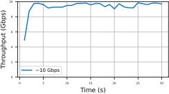

# WTESTBEDS 2023

Official repository for the paper "FABRIC Testbed from the Eyes of a Network Researcher" to WTESTBEDS 2023 - 2º Workshop de Testbeds

# Overview

This repository brings together all the data, and the commands used to generate this data, demonstrated in the article "FABRIC Testbed from the Eyes of a Network Researcher" sent to WTESTBEDS 2023 - 2st Testbeds Workshop.

# FABRIC

FABRIC testbed[^1] has been designed to provide a unique national research infrastructure to enable cutting-edge and exploratory research at-scale in networking.

## Slice definition: requirements and allocation

<p align="center">
    
</p>
<p align="center">
    <em>Topology of FABRIC Testbed</em>
</p>

## Booking a slice

To book a slice in FABRIC Testbed and use its metaresearch functionalities, the experimenter needs to import the “FABlib library” (v. 1.4.3) that provides its API primitives. For example, one may query for available testbed resources and settings by using ```fablib.list_sites()``` and then get 3 random sites that are available for experimentation with the command ```fablib.get_random_sites(count=3)```. There is also a geographic location parameter to select sites located between Los Angeles and New York

```python
from fabrictestbed_extensions.fablib.fablib import FablibManager as fablib_manager

fablib = fablib_manager()
los_angelis_lat_long = (34.049043, -118.259476)
new_york_lat_long = (43.453157655429585, -76.53364473809769)

try:
    sites = fablib.get_random_sites(count=3, filter_function=lambda x:
                                        x['nic_connectx_5_available'] >= 2 and
                                        x['cores_available'] >= 2 and
                                        x['disk_available'] >= 10 and
                                        x['location'][1] > los_angelis_lat_long[1] and
                                        x['location'][1] < new_york_lat_long[1]
                                    )
    print(f"Available Sites: {sites}")
except Exception as e:
    print(f"Exception: {e}")
```

New components can be added to the slice. For example, a dedicated smartNIC (```command add_component()``` or a L2 link, see Figure "Slice visualization". After all the requirementsspecified for the experiment components , the request of the slice can be submitted.

```python
slice_name = 'OSPF_Routing_Topology'
model_name = 'NIC_Basic'
nic_name = ['nic1', 'nic2']
try:
    slice = fablib.new_slice(name=slice_name)
    
    nodes, nics = [], []
    
    for i, name in enumerate(sites):
        nodes.insert(i, slice.add_node(name=f'r{i+1}', site=name, image='default_debian_10'))
    
    for node in nodes:
        nics.insert(i, node.add_component(model=model_name, name=nic_name[0]).get_interfaces()[0])
        nics.insert(i+1, node.add_component(model=model_name, name=nic_name[1]).get_interfaces()[0])
    
    net1 = slice.add_l2network(name='net1', interfaces=[nics[0], nics[3]])
    net2 = slice.add_l2network(name='net2', interfaces=[nics[2], nics[5]])
    net3 = slice.add_l2network(name='net3', interfaces=[nics[4], nics[1]])
    
    slice.submit()
except Exception as e:
    print(f"Exception: {e}")
```

For the sake of simplicity, a tree-node ring will be here used to demonstrate network dynamic routing reacting to node failure, which was explored in the experiments.

<p align="center">
    
</p>
<p align="center">
    <em>Slice visualization: ring topology connected with dedicated smartnics</em>
</p>

## Components configuration and automation

# Running experiments in FABRIC testbed

The tests were conducted on the FABRIC platform using a Jupyter Notebook. The codes used in the tests can be accessed from the article’s repository on GitHub6. Each node in the platform was equipped with 2 cores, 8 GB of RAM, and 10 GB of disk space. The operating system employed for the tests was Rocky Linux 8.5 (Green Obsidian), while the interfaces used were dedicated NICs “Mellanox ConnectX-5 Dual Port 10/25GbE”. iperf3[^2] (v. 3.5) was used to generate the traffic and measure the throughput.

## OSPF: failure recover use case

<p align="center">
    
</p>
<p align="center">
    <em>RTT with events of path failure and path recovery</em>
</p>

## Throughput use case

<p align="center">
    
</p>
<p align="center">
    <em>Default OS/NIC config</em>
</p>

<p align="center">
    
</p>
<p align="center">
    <em>Tuning configuration</em>
</p>

[^1]: BALDIN, Ilya et al. Fabric: A national-scale programmable experimental network infrastructure. IEEE Internet Computing, v. 23, n. 6, p. 38-47, 2019.
[^2]: https://frrouting.org/
